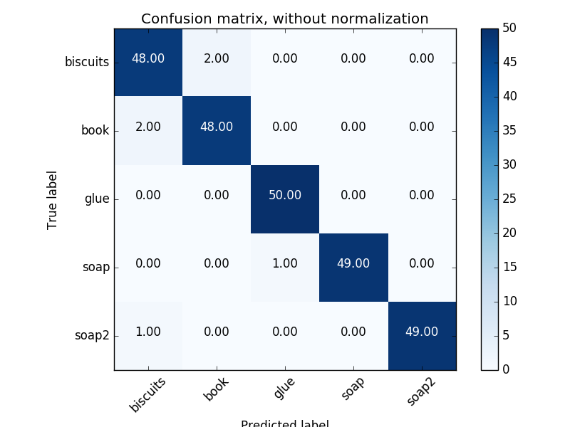

# Project: Perception Pick & Place
This project is to implement a perception pipeline for PR2 robot to detect, recognize and locate different objects on a table.

#### 1. Complete Exercise 1 steps. Pipeline for filtering and RANSAC plane fitting implemented.

The `/pr2/world/points` topic provides the input point cloud data for the pipeline, which contains noises to be removed. The original cloud data is processed by a series of `PCL` filters,

- Voxel grid downsampling filter (`.make_voxel_grid_filter()`)
- Passthrough filter (`.make_passthrough_filter()`)
- Statistical outlier filter (`.make_statistical_outlier_filter()`)

which are implemented between line 54-106 in [project.py](pr2_robot/scripts/project.py).

After that, RANSAC plane fitting is implemented (line 108-127) to isolate the objects of interest from the rest of the scene. The segmentation result is then published to `/pcl_objects` and `/pcl_table` topics, which are visualized as shown below.

#### 2. Complete Exercise 2 steps: Pipeline including clustering for segmentation implemented.  

Euclidean clustering is applied (line 129-162) to create separate clusters for individual items. The following figure shows the clustering result of scenario 2 which has 5 items.

#### 3. Complete Exercise 3 Steps.  Features extracted and SVM trained.  Object recognition implemented.

The `sensor_stick` environment is used to capture features for different items. To launch this environment, use

`roslaunch sensor_stick training.launch`

The capture code is implemented in [capture_features.py](pr2_robot/scripts/capture_features.py), where the object list `models` needs to be specified accordingly. 20, 50 and 60 samples are captured for each item in three scenarios to have enough accuracy. Then the training data is saved as `training_set_*.sav`.

After that, a SVM is implemented in [train_svm.py](pr2_robot/scripts/train_svm) by using the training data from the previous step. The following figures show the training result of the three scenarios.

|   Confusion Matrix    | Confusion Matrix (Normalized) | Accuracy        |
| :-------------------: | :---------------------------: | --------------- |
|  |          | 0.97 (+/- 0.08) |
|  |          | 0.98 (+/- 0.05) |
|  |          | 0.97 (+/- 0.03) |

The trained model is saved as `model_*.sav`, which is then performed in `project.py` to recognize the segmented clusters. As shown in the following figures, recognized objects are assigned to predicted labels accordingly.

3/3 items are correctly identified.

5/5 items are correctly identified.

7/8 items are correctly identified.

To locate an recognized project on the table, the centroid (average in x, y and z) of the set of points belonging to that object is calculated. Then the details of each detected object (`test_scene_num, arm_name, object_name, pick_pose, place_pose`) are packed as ROS messages and also outputted as `.yaml` files (line 219-291 in `project.py`).

